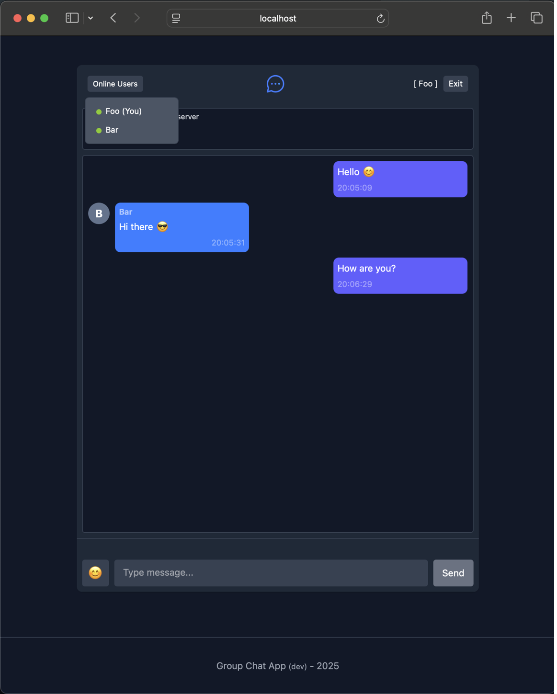
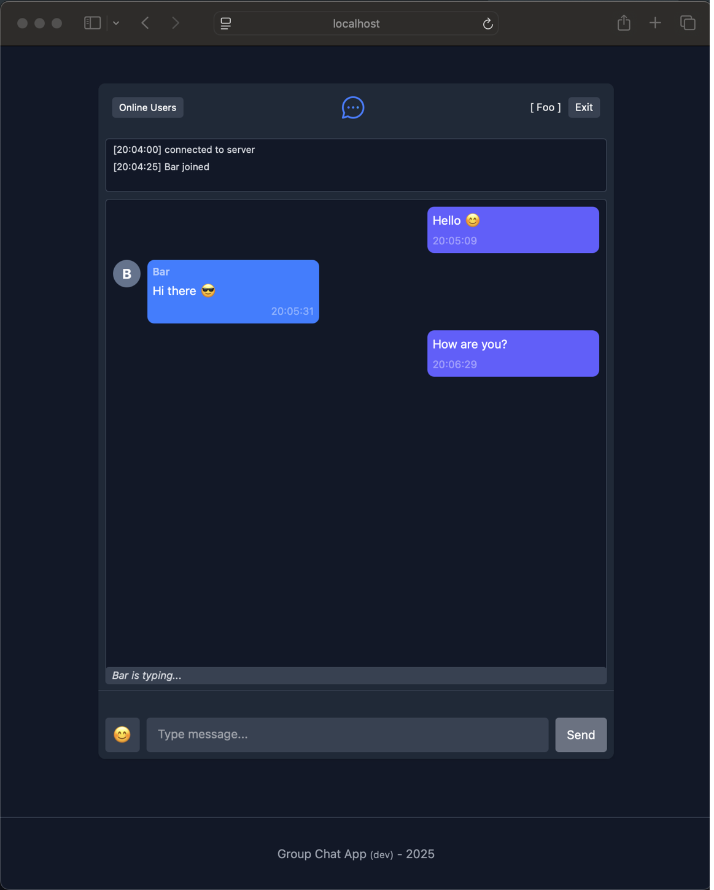
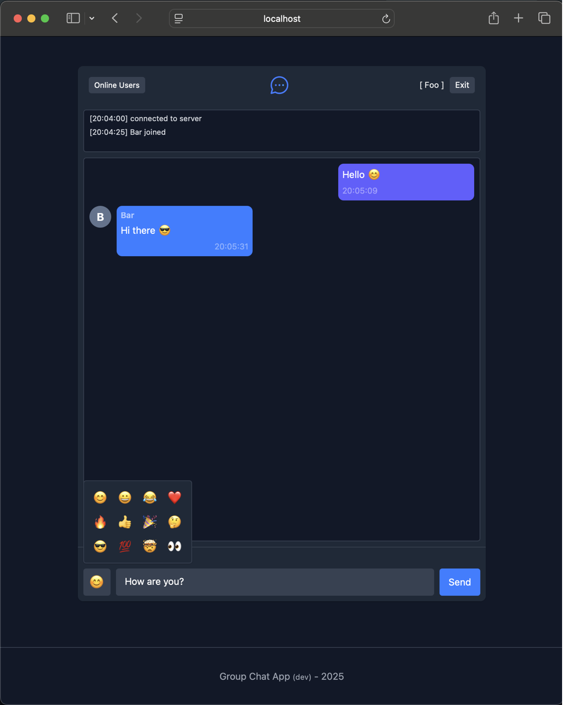
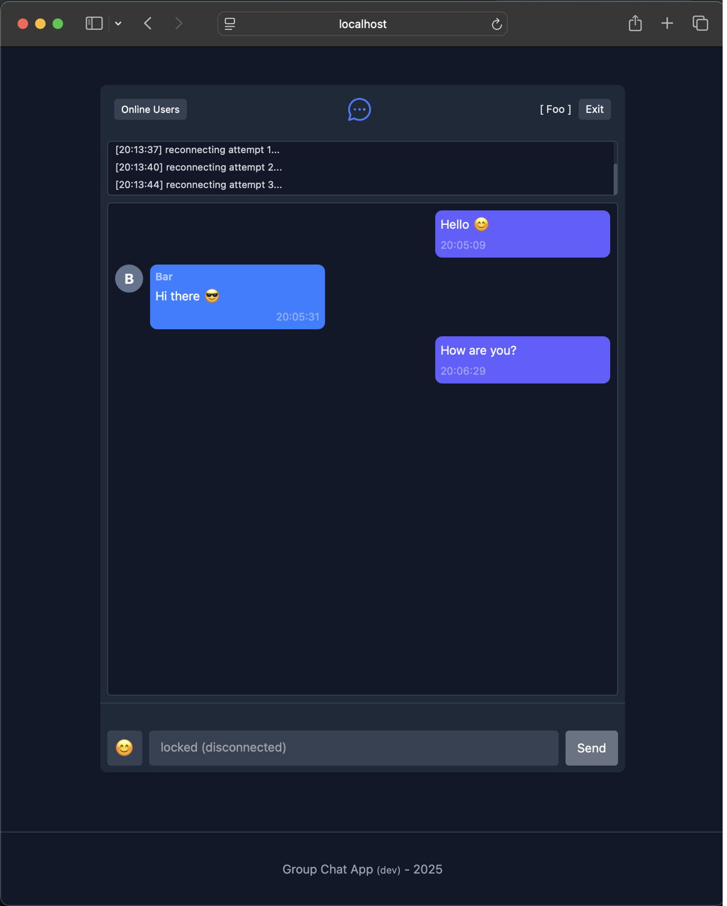

# Group Chat App

A real-time group chat application built with a **Go backend** and a **Vue.js + TypeScript frontend**, communicating via **WebSockets**.  
The system supports real-time messaging, online user presence, typing indicators, and robust connection handling with retries and backoff.

---

## Tech Stack

### Backend
- **Go**
- **WebSockets**
- Runs on **port 8080**
- **Clean Architecture**
- Include **Goroutines per WebSocket connection** for concurrent read/write
- REST API for connection health check

### Frontend
- **Vue.js (SPA)**
- **TypeScript**
- Runs on **port 9090**
- **WebSockets**
- Clean, layered frontend structure
- Built-in **retry & exponential backoff** for connection resilience

---

## Architecture Overview

### Backend (Go – Clean Architecture)

The backend follows Clean Architecture principles:

- **Domain**: Core entities and message models  
- **Use Cases**: Chat logic, user lifecycle, message routing  
- **Interface Adapters**: WebSocket handlers, HTTP handlers  
- **Infrastructure**: Web server, WebSocket server  

Each WebSocket connection:

- Spawns a dedicated **Goroutine**
- Uses a **shared, conventional message structure** agreed upon by frontend and backend
- Handles:
  - Message read/write
  - User join/leave
  - Typing notifications
  - Connection close and failures

---

### Frontend (Vue + TypeScript – Layered Structure)

The frontend is organized into clean layers:

- **UI Components**: Chat UI, user list, typing indicators
- **State / Services**: WebSocket service, retry/backoff logic
- **Models**: Shared message structures
- **Views**: Application-level screens

WebSocket reconnection features:

- Automatic retry with **exponential backoff**
- Handles retry attempts and failure states gracefully
- Disables user actions when the backend is unavailable

---

## Connection & Handshake Flow

1. The frontend calls the backend API:
   ```
   GET /handshake
   ```
2. This endpoint is **polled every 2 seconds**
3. If the handshake is successful:
   - The **Join** button is enabled
   - The user can enter a name and join the chat
4. If the handshake fails:
   - The **Join** button remains disabled
   - Retry continues automatically

---

## Chat Features

- Real-time group messaging
- Online users list (updated instantly)
- Typing indicators
- User join/leave notifications
- Server connection & failure handling
- Retry attempts and retry failure states
- WebSocket-based communication

---

## Ports

| Service   | Port |
|----------|------|
| Backend  | 8080 |
| Frontend | 9090 |

---

## How to Start the Application
**Execute each command in its own terminal session**
### Start the Backend

```bash
cd api && \
go mod tidy && \
go run main.go
```

- Backend runs at `http://localhost:8080`
- WebSocket server(Upgrader for `/`) and `/handshake` API become available

---

### Start the Frontend

```bash
cd ui && \
npm install && \
npm run dev -- --port 9090
```

- Frontend runs at `http://localhost:9090`

---

## How to Use the App

1. Open the frontend in your browser
2. Wait for the handshake to succeed(active join button)
3. Enter a username
4. Click **Join**
5. Start chatting in real time


You will see:

- Online users updating instantly



- Typing indicators as users type



- Emoji picker



- Automatic reconnection if the server goes down




- Not found page(handled wrong path)


---

## Message Handling

- Backend and frontend share a **conventional message structure**
- Messages are routed via WebSockets
- Each client connection is isolated using a Goroutine
- The last 10 messages will be sent to new joined user
- The server manages:
  - User state
  - Presence
  - Broadcast logic

---

## Reliability & Resilience

- WebSocket retry with exponential backoff
- Graceful handling of:
  - Server disconnects
  - Retry attempts
  - Retry failures
- Clear UI feedback for connection state

---

## Summary

This project demonstrates:

- Real-time communication using WebSockets
- Clean Architecture implementation in Go
- Layered frontend design with Vue and TypeScript
- Robust connection handling and fault tolerance

A solid foundation for scalable real-time chat systems.
